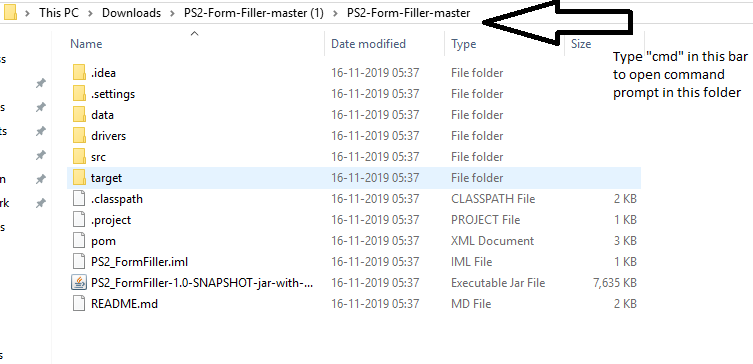
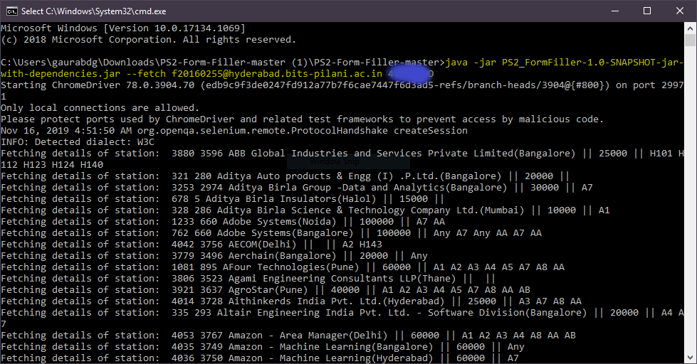

**Make sure you have java installed on your machine**

download link: https://www.oracle.com/technetwork/java/javase/downloads/jdk11-downloads-5066655.html

**Chrome Compatibility**

The chromedriver used is dependent on your os and chrome browser version.
Check here and download accordingly:
https://chromedriver.chromium.org/downloads

After downloading, paste the executable and overwrite(if any) in the `drivers` folder.

# Running executable

1. Download the repo ZIP
2. Go into the root directory of the project and run from terminal/cmd
    - For downloading the station data  
    run `java -jar PS2_FormFiller-1.0-SNAPSHOT-jar-with-dependencies.jar --fetch <username> <password>`
    - To fill the form from your edited sheet  
    run `java -jar PS2_FormFiller-1.0-SNAPSHOT-jar-with-dependencies.jar --upload <username> <password>  <path to modified pref sheet>`

For Windows(in case you are facing difficulties):

`how to open cmd`

`cmd example`

## Minor Issues
- Also, set permissions for the csv file while filling form. Might give access denied error. Edit from the properties->security tab or try placing the file elsewhere(for e.g. Desktop).
- Some PS stations have their stipend/location data exchanged. So when sorted wrt stipend/location, please manually sort them out.
# Building from source

1. Fork/clone the repo
2. Setup Maven
    - Download https://maven.apache.org/download.cgi 
    - Install maven https://www.javahelps.com/2017/10/install-apache-maven-on-linux.html (linux)
    https://www.mkyong.com/maven/how-to-install-maven-in-windows/ (windows)
3. cd into project repo root
4. run `mvn clean compile assembly:single`